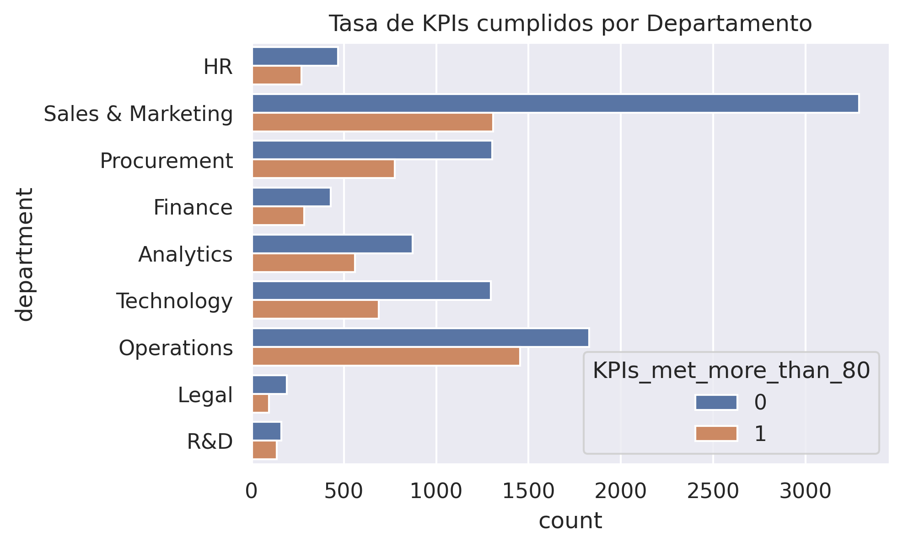
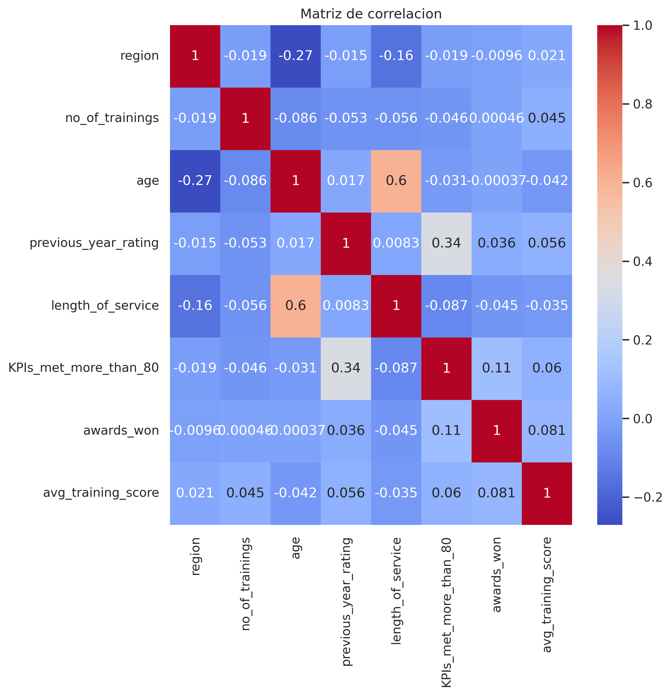
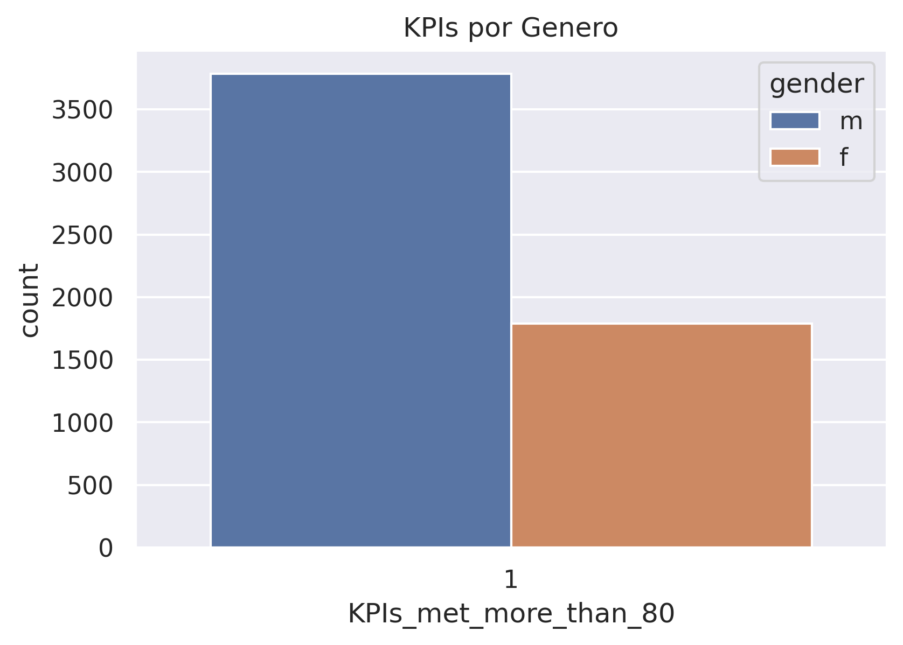

# Análisis y Predicción del Desempeño de Empleados

1. ¿Qué factores se asocian al cumplimiento de KPIs por parte de los empleados?
2. ¿Es posible predecir si un empleado cumplirá sus KPIs?

## Tabla de contenido

- [Descripción del proyecto](#descripción-del-proyecto)
- [Objetivos](#objetivos)
- [Dataset](#dataset)
- [Metodología](#metodología)
- [Estructura del repositorio](#estructura-del-repositorio)
- [Notebooks](#notebooks)
- [Insights destacados](#insights-destacados)
- [Resultados del modelado](#resultados-del-modelado)
- [Cómo ejecutarlo](#cómo-ejecutarlo)
- [Limitaciones y próximos pasos](#limitaciones-y-próximos-pasos)
- [Autor](#autor)

## Descripción del proyecto

Este proyecto analiza datos de recursos humanos de una empresa (departamento, región, educación, género, canal de reclutamiento, entrenamientos, edad, antigüedad, premios, puntaje de capacitación, etc.) para entender qué caracteriza a los empleados que cumplen sus KPIs y para construir un modelo capaz de predecirlo. El flujo de trabajo sigue un pipeline de ciencia de datos: **limpieza → análisis exploratorio → modelado predictivo**, documentado en tres notebooks de Jupyter independientes pero secuenciales.

## Objetivos

- Identificar los factores más asociados al cumplimiento de KPIs (`KPIs_met_more_than_80`).
- Construir y comparar modelos de clasificación binaria capaces de predecir si un empleado cumplirá más del 80% de sus KPIs.
- Traducir los hallazgos en conclusiones accionables para el negocio.

## Dataset

- **Fuente**: [data/employees_final_dataset.csv](data/employees_final_dataset.csv) (dataset original, 17.416 registros).
- **Salida limpia**: [data/employees_cleaned.csv](data/employees_cleaned.csv) (15.416 registros, generado por [Notebooks/01_limpieza_datos.ipynb](Notebooks/01_limpieza_datos.ipynb)).
- **Variables principales**: `department`, `region`, `education`, `gender`, `recruitment_channel`, `no_of_trainings`, `age`, `previous_year_rating`, `length_of_service`, `KPIs_met_more_than_80`, `awards_won`, `avg_training_score`.
- **Variable objetivo**: `KPIs_met_more_than_80` — indica si el empleado cumplió más del 80% de sus KPIs (1) o no (0).

## Metodología

1. **Limpieza de datos** ([Notebooks/01_limpieza_datos.ipynb](Notebooks/01_limpieza_datos.ipynb))
   - Análisis exhaustivo de valores faltantes: estadística descriptiva, patrones de concentración por variable, análisis de intervalos consecutivos y visualización de la distribución de missing.
   - Los valores faltantes se concentran en `education` (4.4%) y `previous_year_rating` (7.82%), están dispersos (no agrupados en regiones del dataframe) y no están correlacionados entre sí.
   - Dado que el porcentaje global de valores faltantes es bajo (1.03%), se aplica eliminación de registros incompletos.
   - Tratamiento adicional de la variable objetivo y exportación del dataset limpio.

2. **Análisis exploratorio (EDA)** ([Notebooks/02_analisis_exploratorio.ipynb](Notebooks/02_analisis_exploratorio.ipynb))
   - Distribución de variables demográficas (género, edad, canal de reclutamiento, educación, región, departamento).
   - Análisis del cumplimiento de KPIs, puntaje de capacitación y premios, desagregados por departamento, género y edad.
   - Foco especial en el departamento Sales & Marketing (el más numeroso).
   - Matriz de correlación y análisis bivariado/multivariado entre variables numéricas y categóricas.

3. **Modelado predictivo** ([Notebooks/03_modelado.ipynb](Notebooks/03_modelado.ipynb))
   - Preprocesamiento: eliminación de variables poco relevantes, codificación de variables categóricas (`LabelEncoder` para binarias, `OneHotEncoder` para `education`), selección de las 5 features más predictivas con `SelectKBest` (f_regression), split entrenamiento/prueba (80/20) y normalización con `StandardScaler`.
   - Modelos entrenados: **Regresión Logística** (línea base para clasificación binaria) y un **modelo de Apilamiento (Stacking)** que combina `DecisionTreeClassifier` y `SVC` como estimadores base con regresión logística como meta-modelo.
   - Evaluación con exactitud, precisión, recall, F1-score, matriz de confusión, curva precisión-recall, curva ROC/AUC y validación cruzada de 10 folds.

## Estructura del repositorio

```
Employees_Analysis_Project/
├── Notebooks/
│   ├── 01_limpieza_datos.ipynb          # Limpieza y tratamiento de valores faltantes
│   ├── 02_analisis_exploratorio.ipynb   # EDA e insights de negocio
│   ├── 03_modelado.ipynb                # Preprocesamiento, modelado y evaluación
│   └── utils.ipynb                      # Funciones auxiliares para análisis de valores faltantes
├── data/
│   ├── employees_final_dataset.csv      # Dataset original (crudo)
│   └── employees_cleaned.csv            # Dataset limpio (salida de 01_limpieza_datos.ipynb)
├── outputs/                             # Gráficas exportadas desde 02_analisis_exploratorio.ipynb (.png)
├── requirements.txt                     # Dependencias del proyecto
└── README.md
```

## Notebooks

| Notebook | Descripción |
|---|---|
| [Notebooks/01_limpieza_datos.ipynb](Notebooks/01_limpieza_datos.ipynb) | Carga del dataset original, diagnóstico y eliminación de valores faltantes, tratamiento de la variable objetivo y generación de `data/employees_cleaned.csv`. |
| [Notebooks/02_analisis_exploratorio.ipynb](Notebooks/02_analisis_exploratorio.ipynb) | Análisis exploratorio completo: distribuciones, comparaciones por departamento/género/edad, correlaciones y conclusiones de negocio. |
| [Notebooks/03_modelado.ipynb](Notebooks/03_modelado.ipynb) | Preprocesamiento de features, entrenamiento y evaluación de modelos de clasificación (Regresión Logística y Apilamiento), comparación de métricas y conclusiones. |
| [Notebooks/utils.ipynb](Notebooks/utils.ipynb) | Accessor de pandas (`df.missing`) con funciones reutilizables para cuantificar y describir valores faltantes. |

## Insights destacados

**¿Qué factores se asocian al cumplimiento de KPIs?**:

**1. El departamento es el factor explicativo dominante**
El cumplimiento de KPIs varía fuertemente entre departamentos (Sales & Marketing, el más numeroso, tiene la tasa más baja; R&D la más alta), mientras que apenas cambia según género o edad.



**2. La calificación del año anterior es la variable con mayor correlación con el cumplimiento de KPIs**
Con un coeficiente de 0.34, es la relación lineal más fuerte con la variable objetivo entre todas las variables numéricas (el resto de correlaciones son débiles).



**3. El género no limita el desempeño, pese al desbalance numérico**
Aunque el 70% de los empleados son hombres, las mujeres muestran una tasa de cumplimiento de KPIs ligeramente superior (38.8%), lo que indica que el género no es un factor asociado al desempeño.



## Resultados del modelado

Comparación de los dos modelos entrenados en [Notebooks/03_modelado.ipynb](Notebooks/03_modelado.ipynb):

| Modelo | Exactitud | Precisión | Recall | F1-score |
|---|---|---|---|---|
| Regresión Logística | 70.3% | 60.7% | 45.6% | 52.1% |
| Apilamiento (Stacking) | 70.7% | 62.6% | 43.3% | 51.2% |

- Ambos modelos tienen un desempeño similar; el apilamiento gana algo de precisión a costa de recall, sin mejorar el F1-score.
- La validación cruzada (10 folds) sobre la regresión logística confirma estabilidad: 71.03% ± 1.29%.
- Las 5 variables más predictivas según `SelectKBest` son: `no_of_trainings`, `previous_year_rating`, `length_of_service`, `awards_won` y `avg_training_score`.
- Dada la similitud de resultados, la regresión logística es preferible por simplicidad e interpretabilidad, salvo que se justifique el apilamiento con un ajuste de hiperparámetros más fino.

## Cómo ejecutarlo

**Requisitos**: Python 3.10+ y Jupyter.

1. Clona el repositorio:
   ```bash
   git clone git@github.com:jbernalg/Employees_Analysis_Project.git
   cd Employees_Analysis_Project
   ```

2. Crea un entorno virtual e instala las dependencias:
   ```bash
   python -m venv venv
   source venv/bin/activate  # En Windows: venv\Scripts\activate
   pip install -r requirements.txt
   ```

3. Ejecuta los notebooks en orden desde Jupyter:
   ```bash
   jupyter notebook Notebooks/
   ```
   Abre y corre `01_limpieza_datos.ipynb` → `02_analisis_exploratorio.ipynb` → `03_modelado.ipynb`.

   > `01_limpieza_datos.ipynb` genera `data/employees_cleaned.csv`, que es el input de los notebooks siguientes.

## Limitaciones y próximos pasos

- El recall de ambos modelos es moderado (43-46%), por lo que una parte importante de los empleados de alto desempeño no es identificada correctamente; valdría la pena explorar balanceo de clases (p. ej. SMOTE) o ajuste del umbral de decisión.
- No se realizó una búsqueda exhaustiva de hiperparámetros (`GridSearchCV`/`RandomizedSearchCV`); es un paso natural para mejorar el modelo de apilamiento.
- Se podrían incorporar variables categóricas adicionales (como `department`) al modelo predictivo, dado que el EDA identificó al departamento como el factor más explicativo del desempeño.

## Autor

**Jeinfferson Bernal**
GitHub: [@jbernalg](https://github.com/jbernalg)
Email: jeinffersonbernal@gmail.com
